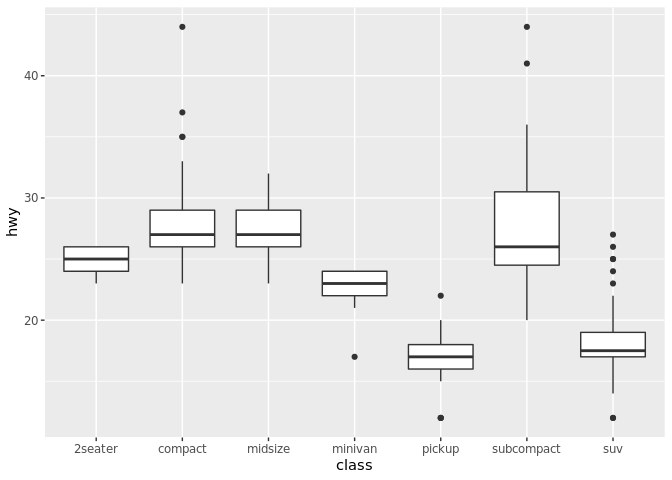
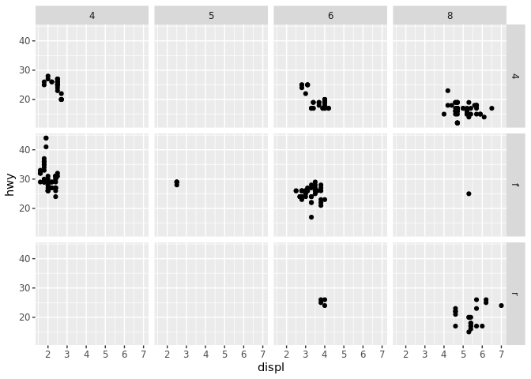
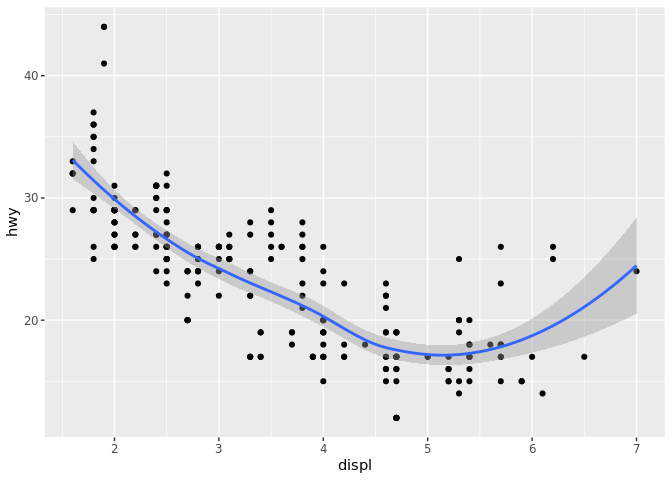

Visualize Data
================
Christina Magana-Ramirez
9/17/2019

Your Turn 0
-----------

Add a setup chunk that loads the tidyverse packages.

``` r
data(mpg)
summary(mpg)
```

     manufacturer          model               displ            year     
     Length:234         Length:234         Min.   :1.600   Min.   :1999  
     Class :character   Class :character   1st Qu.:2.400   1st Qu.:1999  
     Mode  :character   Mode  :character   Median :3.300   Median :2004  
                                           Mean   :3.472   Mean   :2004  
                                           3rd Qu.:4.600   3rd Qu.:2008  
                                           Max.   :7.000   Max.   :2008  
          cyl           trans               drv                 cty       
     Min.   :4.000   Length:234         Length:234         Min.   : 9.00  
     1st Qu.:4.000   Class :character   Class :character   1st Qu.:14.00  
     Median :6.000   Mode  :character   Mode  :character   Median :17.00  
     Mean   :5.889                                         Mean   :16.86  
     3rd Qu.:8.000                                         3rd Qu.:19.00  
     Max.   :8.000                                         Max.   :35.00  
          hwy             fl               class          
     Min.   :12.00   Length:234         Length:234        
     1st Qu.:18.00   Class :character   Class :character  
     Median :24.00   Mode  :character   Mode  :character  
     Mean   :23.44                                        
     3rd Qu.:27.00                                        
     Max.   :44.00                                        

Your Turn 1
-----------

Run the code on the slide to make a graph. Pay strict attention to spelling, capitalization, and parentheses! Sidenote: to insert &lt;- the keyboard shortcut is *Alt+-*.

``` r
ggplot(data = mpg) +
  geom_point(mapping = aes (x = displ, y = hwy))
```


Your Turn 2
-----------

Replace this scatterplot with one that draws boxplots. Use the cheatsheet. Try your best guess.

``` r
ggplot(data = mpg) +
  geom_point(mapping = aes(x = class, y = hwy))
```


``` r
ggplot(data = mpg) +
  geom_boxplot(mapping = aes(x = class, y = hwy))
```



Your Turn 3
-----------

Make a histogram of the `hwy` variable from `mpg`. Hint: do not supply a y variable.

Your Turn 4
-----------

Use the help page for `geom_histogram` to make the bins 2 units wide.

Your Turn 5
-----------

Add `color`, `size`, `alpha`, and `shape` aesthetics to your graph. Experiment.

``` r
ggplot(data = mpg) +
  geom_point(mapping = aes(x = displ, y = hwy))
```


Help Me
-------

What do `facet_grid()` and `facet_wrap()` do? (run the code, interpret, convince your group)

``` r
# Makes a plot that the commands below will modify
q <- ggplot(mpg) + geom_point(aes(x = displ, y = hwy))

q + facet_grid(. ~ cyl)
```


``` r
q + facet_grid(drv ~ .)
```


``` r
q + facet_grid(drv ~ cyl)
```



``` r
q + facet_wrap(~ class)
```


Your Turn 6
-----------

Make a bar chart `class` colored by `class`. Use the help page for `geom_bar` to choose a "color" aesthetic for class.

Quiz
----

What will this code do?

``` r
ggplot(mpg) + 
  geom_point(aes(displ, hwy)) +
  geom_smooth(aes(displ, hwy))
```

    `geom_smooth()` using method = 'loess' and formula 'y ~ x'



------------------------------------------------------------------------

Take aways
==========

You can use this code template to make thousands of graphs with **ggplot2**.

``` r
ggplot(data = <DATA>) +
  <GEOM_FUNCTION>(mapping = aes(<MAPPINGS>))
```
